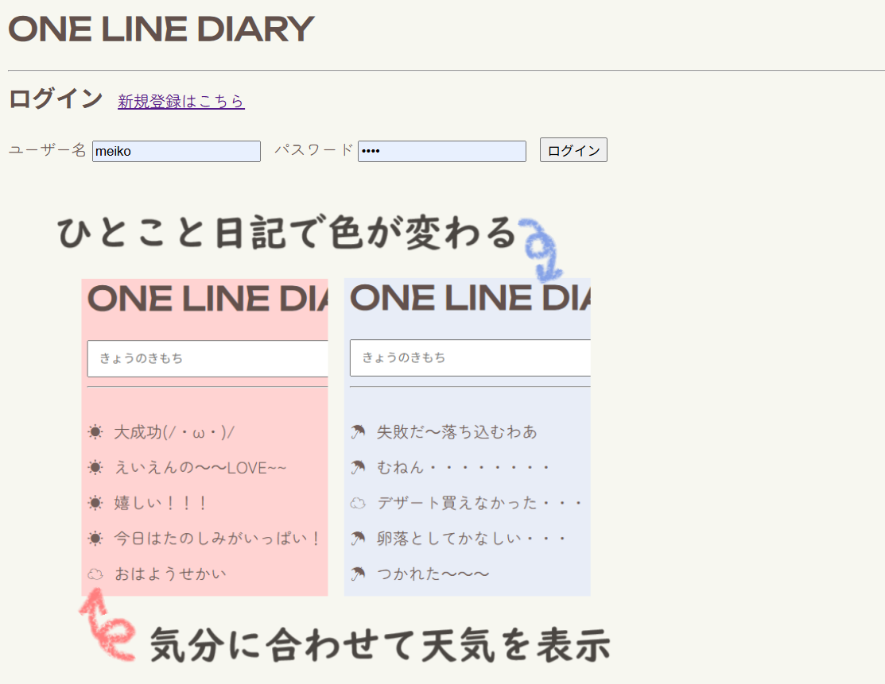

# ONE LINE DIARY
ひとりごとのように気軽に投稿できる、一行日記サイトです。 
その瞬間に感じた気軽なひとことを分析し、&#x2600; &#x2601; &#x2602; を表示します。 
過去20件までの日記を解析し、気分に合わせて背景色もチェンジ！

---

## URL
🔗 https://one-line-diary.onrender.com/login  
簡易的なログイン機能付き  
※ Render（PostgreSQL）の無料枠都合上、2025年内まで公開予定

---

## ONE LINE DIARY 制作に寄せて
「簡単で続けやすい日記アプリが欲しい」と思い制作しました。  
背景色の変化で「自分だけのページを育てている感覚」を、 投稿内容の天気アイコンで**ラベリング効果**によるストレス軽減や、心の整理をサポートします。 
ネガティブなときも「今は心に雨が降っている」と受け止めることで、少しでも気持ちが軽くなれば嬉しいです。

---

## 使用技術
- **フロントエンド**: HTML, CSS
- **バックエンド**: Python (Flask + Jinja2 template)
- **データベース**: PostgreSQL (Render)
- **ライブラリ**: SQLAlchemy, pytz, csv
- **デプロイ**: Render

---

## 機能一覧
- ユーザー認証（ログイン / ログアウト / アカウント削除）
- 投稿・削除機能
- 投稿内容から絵文字を自動付与（csvファイル内のワードを参照）
- 直近20件の投稿内容から背景色を自動変更
- 日付を JST（日本時間）に変換して表示

---

## 今後の展望
- モバイル表示の最適化
- 感情分析ロジックの拡張（自然言語処理ライブラリ活用）
- カレンダー機能の追加(一定期間内の感情をキャッチしてアイコン表示)
